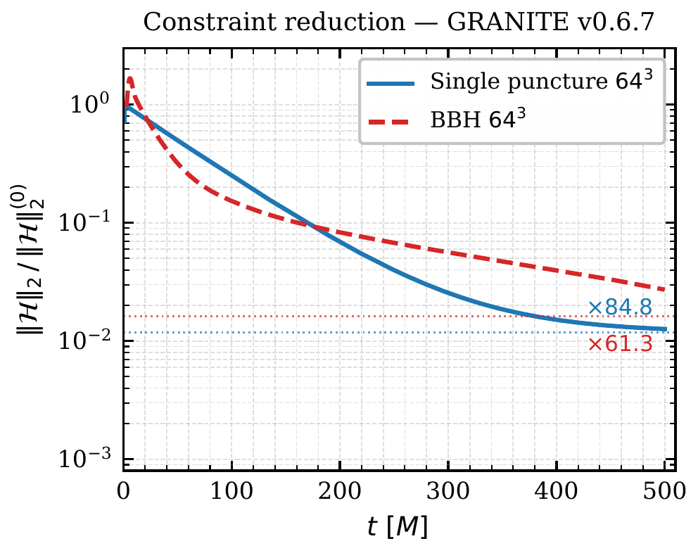
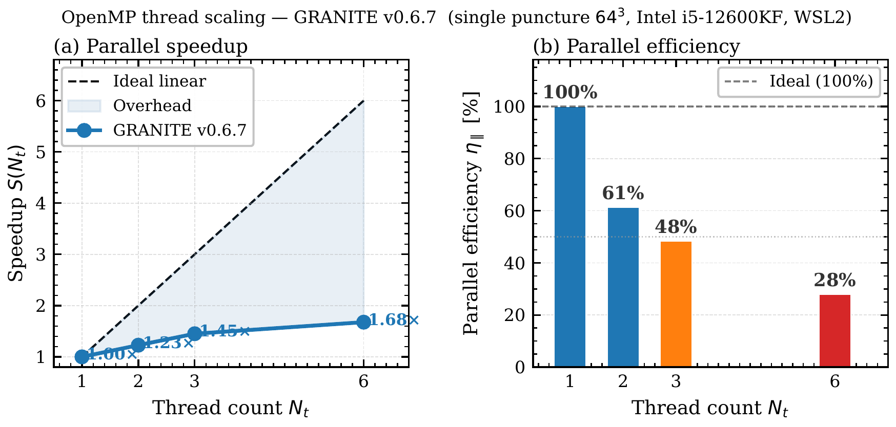
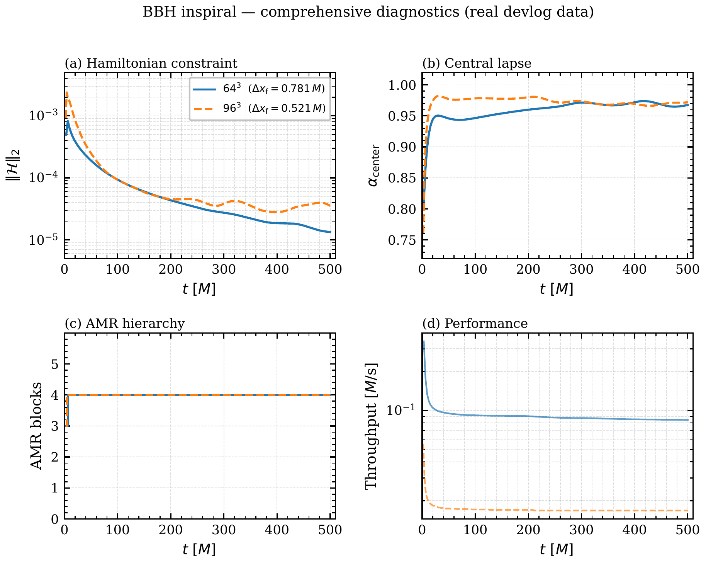

<div align="center">

# GRANITE 🌌
### **General-Relativistic Adaptive N-body Integrated Tool for Extreme Astrophysics**

[](https://github.com/LiranOG/Granite-NR/actions) 
[](https://github.com/LiranOG/Granite-NR#-development-hiatus--may-to-august-2026)

[](https://orcid.org/0009-0008-8035-1308)
[](https://doi.org/10.5281/zenodo.20284043)
[](LICENSE)

[](https://isocpp.org/)
[](https://python.org)
[](https://www.openmp.org/)
[](https://www.open-mpi.org/)

[](https://github.com/LiranOG/Granite-NR/wiki)

---

</div>

> **Status: ⏸️ v0.6.8 pre-release / development hiatus — May to August 2026.**  
> Selected core C++ components are functional and covered by 105 / 107 passing GoogleTest cases across 20 test suites. The `single_puncture` and `B2_eq` benchmarks have been run stably through t = 500 M without NaN events, reaching early inspiral only. Full merger evolution, SXS waveform comparison, CLI-level checkpoint resume, and production radiation-coupled runs remain roadmap targets.

GRANITE is an open-source C++17 research code for 3+1 numerical relativity and General-Relativistic Magnetohydrodynamics (GRMHD). It implements CCZ4 spacetime evolution and Valencia-formulation GRMHD components, with a development focus on modular architecture, explicit benchmark scenarios, Adaptive Mesh Refinement (AMR), HDF5 output, and future GPU/HPC portability.

The project targets compact-object and high-energy astrophysical simulations, including binary black holes, binary neutron-star scenarios, and exploratory multi-body supermassive black-hole configurations. GRANITE should currently be treated as an active research prototype, not as a production-validated NR/GRMHD platform.

---

> [!IMPORTANT]
> ### Development Hiatus — May to August 2026
>
> I am stepping back from active development on GRANITE for a few months
> to attend to personal matters. **The project is not abandoned.** This
> notice is intended to set clear expectations during the pause.
>
> **Current state — `v0.6.8` (Architecture & Stability Pre-release):**
> Selected core subsystems are functional and covered by the current test suite:
> CCZ4 spacetime evolution, Valencia GRMHD components, Berger–Oliger AMR
> infrastructure with subcycling, moving-puncture gauge support, HDF5 checkpoint
> writing, and the main initial-data suite. 105 / 107 tests pass across 20
> GoogleTest suites (2 skipped: horizon finder on coarse 16³ grids).
> 
> The `single_puncture` and `B2_eq` benchmarks have been run stably through
> t = 500 M without NaN events. These runs demonstrate selected stability
> behavior in the tested regimes; they do not yet constitute full merger
> validation or broad production validation. The repository remains public under
> GPL-3.0 for review, testing, citation, and extension.
> 
> **During the hiatus:**
> - Issues, pull requests, and discussions remain open and will be
>   reviewed in full upon return. Nothing will be dismissed or closed
>   without a proper response.
> - Replies may be intermittent or absent. Please do not interpret
>   silence as disinterest — every submission will be addressed.
> - The Zenodo record (DOI: [10.5281/zenodo.20284043](https://doi.org/10.5281/zenodo.20284043))
>   and the in-preparation arXiv preprint
>   (`docs/paper/granite_preprint_v067.tex`) remain the canonical
>   scientific references for this version.
>
> **Impact on the roadmap.** A multi-month pause necessarily affects
> downstream milestones. The `v0.7.0` target (currently listed as
> Q4 2026 — GPU CUDA kernels, `--resume` checkpoint restart, M1 wired
> into the RK3 loop) and all subsequent versions (`v0.8.0`, `v0.9.0`,
> `v1.0.0`) will be re-evaluated and updated in `CHANGELOG.md` and the
> roadmap table once active development resumes. I would rather publish
> revised dates that I can meet than hold to a schedule that no longer
> reflects reality.
>
> **Resumption:** active development resumes approximately
> **June–August 2026.**
>
> Thank you for your patience and for your continued interest in GRANITE.
>
>  *Liran M. Schwartz (LiranOG), Founder & Lead Developer*  
> — Contact: `scliran9@gmail.com` · ORCID: [0009-0008-8035-1308](https://orcid.org/0009-0008-8035-1308)

> [!NOTE]
> ### Why this is a pre-release
>
> v0.6.8 includes a significant architecture and repository refactor: CMake module
> boundaries were made more explicit, CLI workflows were reorganized, Python
> tooling was moved toward a package-based layout, and documentation paths are
> being synchronized after the repository rename to `Granite-NR`.
>
> This release is therefore intended for review, testing, and stabilization rather
> than as a fully stable user-facing release. Integration bugs, documentation
> mismatches, platform-specific build issues, and edge-case regressions may still
> exist. Reports through GitHub Issues or Discussions are especially useful for
> stabilizing this line before the next development stage.

## 📖 Table of Contents

- [✨ Key Features](#-key-features)
- [⚖️ How GRANITE Compares](#️-how-granite-compares)
- [📊 Benchmark Results](#-benchmark-results)
- [🚀 Quick Start Guide](#-quick-start-guide)
  - [Step 1 — Clone the Repository](#step-1--clone-the-repository)
  - [Step 2 — Install Dependencies & Build](#step-2--install-dependencies--build)
  - [Step 3 — Run the Health Check](#step-3--run-the-health-check-pre-flight)
  - [Step 4 — Run the Unit Tests](#step-4--run-the-unit-tests)
  - [Step 5 — Run the Developer Benchmark](#step-5--run-the-developer-benchmark)
  - [Step 6 — Run a Full Simulation](#step-6--run-a-full-simulation)
  - [Step 7 — HPC / SLURM Deployment](#step-7--hpc--slurm-deployment)
- [📁 Repository Structure](#-repository-structure)
- [🗺️ Roadmap](#️-roadmap)
- [⚠️ Known Limitations](#%EF%B8%8F-known-limitations-v068)
- [📋 Versioning Policy](#-versioning-policy-pre-100)
- [🤝 Open for Collaboration](#-open-for-collaboration)
- [🛠️ Contributing](#%EF%B8%8F-contributing)
- [📚 Documentation](#-documentation)
- [🗂 The Genesis Archive: Background & Motivation](#-the-genesis-archive-background--motivation)
- [🌀 VORTEX: The Interactive WebGL Simulator](#-vortex-the-interactive-webgl-simulator)
- [📎 Citing GRANITE](#-citing-granite)
- [👥 Contributors](#-contributors)
- [📜 License](#-license)

---

## ✨ Key Features

> [!IMPORTANT]
> **Current development status — please read before the feature list.**
>
> GRANITE is an **active research project** maintained by an independent solo
> developer. The list below includes implemented subsystems, partially integrated
> components, and roadmap-oriented architecture targets. Each capability should
> be read together with the limitation notes and validation status below.
>
> - **Merger runs are a v0.8 target.** The t=500M BBH benchmarks below reach *early inspiral only* — no merger has been observed. Full merger + SXS catalog validation is planned for v0.9.
> - **M1 radiation transport** is compiled and unit-tested, but is **not yet wired** into the main RK3 evolution loop.
> - **`--resume` checkpoint restart** is not yet exposed at the CLI (`writeCheckpoint()` works; the `--resume` flag is a v0.7 target).
> - **Recoil velocity** (`computeRecoilVelocity`) throws `std::runtime_error` — not yet implemented.
> - **AMR reflux correction** at coarse-fine interfaces: known accuracy limitation.
> - **Test coverage:** 105 / 107 GoogleTest cases currently pass across 20 suites. The suite covers the major C++ physics and infrastructure modules, but passing unit tests do not replace convergence testing, cross-code comparison, or full production validation.
> - **Native Windows** unsupported; use WSL2. **macOS** is experimentally supported via Homebrew (community-tested, not CI-gated).
> - **Photonic Hardware Abstraction Layer (HAL) is not implemented:** it is a long-term architecture and refactoring target for future hardware-agnostic CPU/GPU/experimental accelerator backends, not an active execution path or validated photonic backend.
>
> See [Known Limitations](#%EF%B8%8F-known-limitations-v068) for the full table.

- **Spacetime evolution (CCZ4):** CCZ4 evolution infrastructure for the Einstein field equations, using moving-puncture gauge conditions and active constraint damping. Current default parameters include κ₁ = 0.02 and η = 2.0 in the documented benchmark configurations.

- **GRMHD and matter evolution:** Valencia-formulation GRMHD components with HRSC reconstruction options including MP5, PPM, and PLM, together with HLLE/HLLD Riemann-solver support and constrained-transport infrastructure for magnetic-field divergence control.

- **Adaptive Mesh Refinement (AMR):** Dynamic block-structured Berger–Oliger AMR infrastructure with subcycling, gradient-based and puncture-tracking refinement triggers, iterative union-merge box aggregation, trilinear prolongation, volume-weighted restriction, and per-step regridding integrated into the RK3 loop. The framework supports up to 12 refinement levels in design; validation to date is limited to 4-level benchmark runs.

- **Initial data:** Built-in support for Brill–Lindquist, Bowen–York, Two-Punctures, and Superposed Kerr–Schild black-hole initial-data configurations, plus TOV neutron-star initial data. Complex N-body configurations remain an active validation target and should be treated as exploratory until benchmarked.

- **Radiation and neutrino transport:** Hybrid neutrino leakage and M1 two-moment transport modules are present and covered by unit tests. They are not yet wired into the main RK3 production evolution loop; this integration is a v0.7 target.

- **Diagnostics and gravitational-wave extraction:** Apparent-horizon finding, Newman–Penrose Ψ₄ extraction at multiple radii, constraint monitoring, and Python-facing telemetry output. Recoil-velocity estimation is planned but `computeRecoilVelocity` is not implemented in v0.6.8.

- **HDF5 I/O and checkpointing:** Parallel MPI-IO HDF5 output for grid snapshots and time-series diagnostics. `writeCheckpoint()` serializes the AMR hierarchy, grid blocks, evolved variables, step count, and simulation time. `readCheckpoint()` exists, while CLI-level `--resume` workflow integration remains a v0.7 target.

- **Parallel execution:** MPI communication with non-blocking `Isend` / `Irecv` patterns and OpenMP support. CUDA/GPU offloading is planned but not active in v0.6.8.

- **Equation of state support:** Tabulated nuclear EOS support with trilinear interpolation, with an ideal-gas fallback path.

- **Hardware Abstraction Layer (HAL) [long-term design target]:** Planned architecture work to decouple mathematical operators, memory layout, and execution policy for future CPU/GPU/accelerator portability. Experimental photonic/optical accelerator support is a long-term research direction, not an implemented backend in v0.6.8.

---

## ⚖️ How GRANITE Compares

The table below is a high-level comparison of GRANITE v0.6.8 against several established open-source NR or astrophysical simulation codes.  
It is intended to clarify project scope, not to claim superiority over mature frameworks. Capability status depends on code version, enabled modules, problem setup, and validation standard. 

GRANITE v0.6.8 is currently tested on selected single-BH and early-inspiral BBH benchmarks; broader validation remains ongoing.

### Summary Comparison

| Capability | Einstein Toolkit | GRChombo | SpECTRE | AthenaK | **GRANITE v0.6.8** |
|---|:---:|:---:|:---:|:---:|:---:|
| CCZ4 formulation | ✅ | ✅ | ✅ | ❌ | ✅ |
| Full GRMHD (Valencia) | ✅ | ✅ | 🔶 | ✅ | ✅ |
| M1 radiation transport | ✅ | ❌ | ❌ | ❌ | 🔵 |
| Dynamic AMR (subcycling) | ✅ | ✅ | ✅ | ✅ | 🔶 |
| N > 3 BH simultaneous merger | ❌ | ❌ | ❌ | ❌ | 🟡 | 
| Open license | LGPL | ✅ MIT | ✅ MIT | ✅ BSD | ✅ GPL-3.0 |

*(Table abridged. See the full feature matrix below.)*

> - *N > 3 BH: This is a research-frontier target, not a validated v0.6.8 capability. We are not aware of an open-source NR/GRMHD workflow
> that currently provides a fully resolved, stable, radiation/GRMHD-coupled simultaneous merger of more than three black holes as a
> routine reproducible benchmark. This comparison depends strongly on definitions, code versions, enabled modules, and validation
> criteria. Achieving this in GRANITE is a long-term goal that depends on GPU/HPC scaling, AMR reflux completion, and extensive
> validation.*
>
> - *Dynamic AMR marked 🔶 for GRANITE: the Berger–Oliger subcycling hierarchy
> is implemented and integrated into the production RK3 loop with live
> per-step regridding and puncture-tracking spheres. However, three known
> limitations remain: (1) the reflux correction operator at coarse–fine
> interfaces is a stub — computed but not applied; (2) AMR prolongation is
> trilinear (2nd-order) only; (3) production benchmarks are validated at
> 4 refinement levels, not the 12-level target required for B5\_star.
> Full ✅ status is the v0.8 target.*

**Legend:**
* ✅ = **Implemented and integrated** for the stated scope
* 🔵 = **Module implemented / pending production integration**
* 🔶 = **Partial implementation or known limitations**
* 🟡 = **Roadmap / research target; no validated production result yet**
* ❌ = **Not available in the compared scope**

> [!NOTE]
> 💡 **Deep-Dive Architectural Analysis & Full Comparison**
> 
> The table above provides only a high-level overview. For an exhaustive, source-cited capability breakdown against *Einstein Toolkit, GRChombo, SpECTRE, and AthenaK*, please refer to the **[Detailed Comparison & Architecture Guide](docs/developer_guide/COMPARISON.md)**. 
---

## 📊 Benchmark Results

The benchmark results below are from local production-style runs on a single desktop workstation (Intel i5-8400, 6-core, 16 GB DDR4, Linux/WSL2), unless otherwise stated. 
The reported values are taken from simulation logs and are intended to be reproducible using the documented benchmark configurations, subject to compiler, platform, MPI/OpenMP, and hardware differences.

> - **Hardware note:** The three-resolution gauge-wave convergence test, the `{1,2,3,6}`-thread scaling extension to 128³, and the matched BBH convergence series targeting SXS:BBH:3634 have **not yet been executed** — access to the second development machine (i5-12600KF) is temporarily unavailable. These are v0.7 deliverables; once hardware is restored, all runs will be completed and results published here.

### Single Moving Puncture — Schwarzschild Stability

| Resolution | AMR Levels | dx finest | ‖H‖₂ t=0 | ‖H‖₂ final | Reduction | t\_final | NaN events |
|---|:---:|:---:|:---:|:---:|:---:|:---:|:---:|
| 64³ | 4 | 0.1875 M | 1.083 × 10⁻² | 1.277 × 10⁻⁴ | **×84.8** | 500 M ✅ | 0 |
| 128³ | 4 | 0.09375 M | 1.855 × 10⁻² | 1.039 × 10⁻³ | **×17.9** | 120 M ✅ | 0 |

### Binary Black Hole Inspiral — Equal-Mass, Two-Punctures / Bowen-York

| Resolution | AMR Levels | dx finest | ‖H‖₂ peak | ‖H‖₂ final (t=500M) | Reduction | Wall time | Throughput | NaN events |
|---|:---:|:---:|:---:|:---:|:---:|:---:|:---:|:---:|
| 64³ | 4 | 0.781 M | 8.226 × 10⁻⁴ | **1.341 × 10⁻⁵** | **×61.3** | 98.9 min | 0.084 M/s | 0 |
| 96³ | 4 | 0.521 M | 2.385 × 10⁻³ | **3.538 × 10⁻⁵** | **×67.4** | 496 min | 0.017 M/s | 0 |

> - **What ‖H‖₂ reduction means:** The Hamiltonian constraint measures how accurately the evolved spacetime satisfies Einstein's equations. A monotonically *decreasing* ‖H‖₂ over 500 M of simulated time is a necessary (but not sufficient) indicator of **numerical stability and correct constraint damping**.
>
> - **What these benchmarks do NOT yet prove:** The t=500M runs above reach *early inspiral phase only* (no merger observed). Merger-waveform validation against the SXS catalog is a **v0.8–v0.9 target**. See [Known Limitations](#️-known-limitations-v068).
>
> 📄 Raw telemetry, step-by-step logs, and extended resolution tables: [`docs/user_guide/BENCHMARKS.md`](./docs/user_guide/BENCHMARKS.md)

---

### Constraint Violation Reduction

> **Figure 1:** Normalized ‖H‖₂ decay demonstrated from devlog telemetry —
> single puncture 64³ (×84.8 reduction) and equal-mass BBH 64³ (×61.3 reduction)
> over 500 M of evolution. Zero NaN events recorded in both runs.

<p align="center">
  
</p>

---

### OpenMP Thread Scaling

> **Figure 2:** Parallel speedup and efficiency on Intel i5-12600KF (6 P-cores, WSL2).
> Physics output is bit-for-bit identical across all thread counts.
> Extension to 128³ base grid pending hardware restoration (v0.7 target).

<p align="center">
  
</p>

---

### BBH Comprehensive Diagnostics

> **Figure 3:** Four-panel BBH evolution from devlog telemetry —
> ‖H‖₂ decay, central lapse α, AMR block count, and throughput (M/s) over 500 M.

<p align="center">
  
</p>

---

## 🚀 Quick Start Guide

> [!TIP]
> **Stable baseline for first-time users:** The current `main` branch is under active v0.6.8 restructuring, including CLI cleanup, Python tooling migration, documentation synchronization, and benchmark-schema updates. If you prefer a known-good first-run workflow without debugging current `main`-branch integration changes, use the `v0.6.5` tag as the recommended stable baseline.
> 
> Download the ZIP archive from the `v0.6.5` tag, extract it inside WSL/Linux, and follow the commands documented in that tagged version. For live simulation monitoring, use the legacy `sim_tracker.py` workflow included with `v0.6.5`, which was the most stable telemetry path for that release.
> ```bash
> Stable v0.6.5 ZIP workflow
>1. Open the repository **Tags** page.
>2. Download **v0.6.5 → zip**.
>3. Extract the ZIP inside WSL/Linux.
>4. Follow the build/run commands included in the tagged version.
>5. Use the legacy `sim_tracker.py` workflow for live telemetry.
>```

>  [!WARNING]
> **v0.6.8 — Active Stabilization in Progress**
>
> A recent structural reorganisation of the `scripts/` directory introduced several integration issues that are currently being triaged and resolved. Some CLI workflows, Python analysis tools, and virtual environment setup steps may temporarily behave unexpectedly until the patch is complete.  
>
> The intended C++ physics behavior is unchanged relative to the current v0.6.x baseline, and the C++ test suite currently reports 105 / 107 passing tests (2 skipped: horizon finder on coarse 16³ grid).
> However, users should still treat v0.6.8 as a stabilization line until CLI, Python tooling, and documentation paths are fully synchronized.
>
> Fixes are being pushed continuously. If something doesn't work as documented, check [`CHANGELOG.md`](./CHANGELOG.md) for the latest patch status or open an [issue](https://github.com/LiranOG/Granite-NR/issues).

### Step 1 — Clone the Repository
```bash
git clone https://github.com/LiranOG/Granite-NR.git
cd Granite-NR
```

> [!NOTE]
> **OS Requirement:** GRANITE is developed and CI-tested on **Linux** and **WSL2**. Native Windows is unsupported. macOS via Homebrew is experimentally supported — community-tested, not covered by CI.
> 
> *Hitting a wall?* See [**INSTALL.md**](./docs/getting_started/Installation.md) for step-by-step guides and exhaustive troubleshooting.

### Step 2 — Install Dependencies & Build
 
#### 💎 Windows — WSL2 / Ubuntu (the only supported Windows path)
 
> [!NOTE]
> Native Windows builds via PowerShell or Conda are **not supported**. Use WSL2.
 
**Prerequisites for WSL/Linux:**
```bash
sudo apt update && sudo apt install -y cmake build-essential libhdf5-dev libopenmpi-dev yaml-cpp
python3 scripts/run_granite.py build
```
 
#### 🐧 Linux — Ubuntu / Debian
**Prerequisites for WSL/Linux:**
```bash
sudo apt update && sudo apt install -y cmake build-essential libhdf5-dev libopenmpi-dev yaml-cpp
python3 scripts/run_granite.py build
```
 
#### 🐧 Linux — Fedora / RHEL / Rocky
```bash
sudo dnf groupinstall -y "Development Tools"
sudo dnf install -y cmake hdf5-devel openmpi-devel yaml-cpp-devel
module load mpi/openmpi-x86_64
python3 scripts/run_granite.py build
```
 
#### 🍎 macOS — Homebrew (experimental, community-tested)
 
> [!NOTE]
> macOS is not covered by CI. These instructions have been community-tested on Apple Silicon (M1/M2) and Intel Macs. Report issues via GitHub.
 
```bash
brew install cmake hdf5 open-mpi yaml-cpp
python3 scripts/run_granite.py build
```
 
---
 
### Step 3 — Run the Health Check (Pre-Flight)
 
Verify Release optimization flags and OpenMP core allocation before any simulation.
 
#### 🪟 Windows (PowerShell / CMD / Conda)
```powershell
python scripts/health_check.py
```
 
#### 🐧 Linux / 💎 WSL2 / 🍎 macOS
```bash
python3 scripts/health_check.py
```
 
---
 
### Step 4 — Run the Unit Tests
 
#### C++ physics suite
```bash
build/bin/granite_tests
# or: cd build && ctest --output-on-failure && cd ..
```
Expected: `[  PASSED  ] 105 tests.` with `[  SKIPPED ] 2 tests.` (20 suites — CCZ4, GRMHD, AMR, horizon, M1, HDF5 I/O)
 
#### Python analysis suite
```bash
# One-time setup (Ubuntu / WSL2 / Debian — required before first use)
sudo apt install python3.12-venv        # needed on Ubuntu 24.04 / WSL2
python3 -m venv .venv                   # create virtual environment
source .venv/bin/activate               # activate — repeat each new terminal
pip install pytest                      # install test runner
 
# Run the tests (venv must be active)
python3 -m pytest tests/python -v
```
Expected: `X passed` — 0 failures, 0 errors.
 
---
 
### Step 5 — Run the Developer Benchmark
 
> [!NOTE]
> The analytical scripts live in the `granite_analysis` Python package.
> **One-time setup (Linux / WSL2 / macOS):**
> ```bash
> sudo apt install python3.12-venv   # Ubuntu 24.04 / WSL2 only — skip on macOS/Fedora
> python3 -m venv .venv          # create venv (gitignored)
> source .venv/bin/activate      # activate — repeat each new terminal
> pip install -e .[dev]          # install package + dev tools
> ```
> **Windows (PowerShell):**
> ```powershell
> python -m venv .venv
> .venv\Scripts\Activate.ps1
> pip install -e .[dev]
> ```
 
```bash
# 1. Integrated pipeline — build → run → live rich dashboard
python3 scripts/run_granite.py dev
 
# 2. Watch mode — auto-rebuild + restart on any src/ change
python3 scripts/run_granite.py dev --watch
 
# 3. Direct CLI on a log file
python3 -m granite_analysis.cli.dev_benchmark run.log
python3 -m granite_analysis.cli.dev_benchmark run.log --benchmark B2_eq --quiet --json results.json --csv results.csv
 
# 4. Live pipe from the engine
build/bin/granite_main benchmarks/single_puncture/params.yaml \
    | python3 -m granite_analysis.cli.sim_tracker --json run.json
```
 
---
 
### Step 6 — Run a Full Simulation
 
```bash
# Run a named benchmark (pipes engine output to sim_tracker automatically)
python3 scripts/run_granite.py run --benchmark gauge_wave
python3 scripts/run_granite.py run --benchmark single_puncture
python3 scripts/run_granite.py run --benchmark B2_eq
 
# Or pipe the engine manually and export telemetry
build/bin/granite_main benchmarks/B2_eq/params.yaml \
    | python3 -m granite_analysis.cli.sim_tracker \
        --json telemetry.json \
        --csv  telemetry.csv
```
 
> [!IMPORTANT]
> Always run `python3 scripts/health_check.py` before `B2_eq`.
> See [`docs/user_guide/DEPLOYMENT_AND_PERFORMANCE.md`](./docs/user_guide/DEPLOYMENT_AND_PERFORMANCE.md).
 
**What healthy output looks like:**
```
  step=80  t=5.0000M  α_center=0.029 [RECOVER]  ‖H‖₂=0.153 [OK]
  Phase: Lapse recovering — trumpet stable ✓
  Advection CFL: 0.938 ✓ stable
```
- `α_center` drops 1 → ~0.003 (lapse collapse), recovers to ~0.03 (trumpet formation) ✓
- `‖H‖₂ < 1.0` through `t = 6M` — constraints satisfied ✓
- NaN Forensics: "No NaN events detected" ✓
Export telemetry at any time with `--json out.json` or `--csv out.csv`.
 
---
 
### Step 7 — HPC / SLURM Deployment
 
```bash
# Generate a SLURM submission script (created at jobs/submit_granite.sbatch)
python3 scripts/run_granite_hpc.py \
    build/bin/granite_main \
    benchmarks/B2_eq/params.yaml \
    --slurm \
    --mpi-ranks 256 \
    --omp-threads 16
 
# Submit on the cluster
sbatch jobs/submit_granite.sbatch
```
 
The generated script automatically pipes the engine output through
`granite_analysis.cli.sim_tracker` for real-time telemetry on the cluster.
 
> [!IMPORTANT]
> Complete A-to-Z setup, dependencies, and full Q&A troubleshooting:
> [**docs/getting_started/Installation.md**](./docs/getting_started/Installation.md)
 
---

## 📁 Repository Structure

```text
GRANITE/
├── benchmarks/          # Simulation presets (YAML + expected output).
├── containers/          # Dockerfile + Singularity/Apptainer for HPC.
├── docs/                # Technical documentation, preprint, and paper figures.
│   └── paper/                 # PRD preprint (LaTeX + PDF) + 13 publication figures.
├── include/granite/     # Public C++ headers indexed by subsystem.
├── python/              # granite_analysis installable package (pip install -e .).
├── runs/                # ⚠ gitignored — job scripts and parameter scans.
├── scripts/             # Build/run wrappers, health check, live diagnostics.
├── src/                 # C++17 physics kernels (~8,900 lines).
├── tests/               # 107-test GoogleTest suite across 20 suites (covers all physics modules: CCZ4, GRMHD, AMR, horizon, M1, HDF5 I/O, initial data).
└── viz/                 # Post-processing and visualisation scripts.
    └── vortex_eternity/       # The new WebGL frontend directory
```

> For a complete file-by-file inventory with line counts, module descriptions,
> and subsystem notes, see [`docs/DEVELOPER_GUIDE.md`](./docs/developer_guide/DEVELOPER_GUIDE.md).

---

## 🗺️ Roadmap

| Version | Target | Status | Key Deliverables |
|---|---|:---:|---|
| **v0.6.5** | Q2 2026 | ✅ **Released** | BBH stable to t=500M, 4-level AMR, 92 tests, Python dashboard |
| **v0.6.7** | Q2 2026 | ✅ **Released** | VORTEX Gold Master, dynamic AMR fully wired, HDF5 checkpoint write |
| **v0.6.8** | Q2 2026 | ✅ **Released** | Architecture & Stability - Monolithic decomposition, explicit CMake modules, CLI UX overhaul, and full Wiki sync |
| **v0.7.0** | Q4 2026 | 🔄 In Progress | GPU CUDA kernels, `--resume` checkpoint restart CLI, M1 wired into RK3 loop |
| **v0.8.0** | Q1 2027 | 📋 Planned | Tabulated nuclear EOS + reaction network |
| **v0.9.0** | Q2 2027 | 📋 Planned | Full SXS catalog validation (~60 BBH configs), multi-group M1 |
| **v1.0.0** | Q3 2027 | 🎯 Target | Community-facing release; B5\_star validation target if GPU/HPC scaling, AMR reflux, and benchmark review are completed |

**Proposed scaling path toward B5\_star:** desktop development benchmarks → GPU-porting experiments → small cluster scaling studies → larger AMR/HPC production trials.  

The currently estimated upper-end resource target is approximately 12 AMR levels, ~2 TB RAM, and ~5×10⁶ CPU-hours, but this estimate remains provisional until profiling and scaling studies are completed.

---

## ⚠️ Known Limitations (v0.6.8)

The limitations below are known and documented. Some are active v0.7 engineering targets; others require additional hardware access, community testing, or broader validation before they can be resolved.

| Limitation | Impact | Status | Planned Fix |
|---|---|:---:|---|
| v0.6.8 is a pre-release after major refactoring | CLI/Python/docs integration may expose regressions even if C++ tests pass | 🔄 Active | v0.6.8 patch line / v0.7 |
| `writeCheckpoint()` fully implemented; `--resume` CLI flag not yet wired | Long runs cannot be resumed without code modification | 🔄 Active | v0.7 |
| M1 radiation built but not wired into RK3 loop | Radiation not active in production runs | 🔄 Active | v0.7 |
| `alpha_center` reads from AMR level 0, not finest level near puncture | Misleading lapse diagnostic | 📋 Known | v0.7 |
| GTX 1050 Ti not viable for FP64 GPU compute | GPU path requires H100-class hardware | 📋 Known | Post GPU porting |
| Native Windows unsupported; macOS Homebrew experimental (not CI-gated) | Limits CI coverage; macOS issues cannot be caught automatically | 📋 Tracked | v0.8+ |
| Tangential BY momenta required for inspiral p_t ≈ ±0.0954 per BH (quasi-circular, d = 10 M) | Zero momenta → head-on, not inspiral | 📝 Documented | User parameter |

> Full debug context: [`docs/diagnostic_handbook.md`](./docs/user_guide/diagnostic_handbook.md)

---

## 📋 Versioning Policy (Pre-1.0.0)

> [!IMPORTANT]
> **Pre-1.0.0 versioning is tracked exclusively in [`CHANGELOG.md`](./CHANGELOG.md)** — not through GitHub Releases or GitHub's release notes UI. This keeps the complete engineering audit trail (every physics fix, API decision, and CI repair) in a single, richly-documented source of truth that lives alongside the code.

GRANITE uses [Semantic Versioning](https://semver.org/spec/v2.0.0.html). During the pre-1.0 phase, minor version bumps (`v0.x`) may carry breaking API changes as the engine matures toward production readiness.

### Version History (v0.5.0+)

| Version | Date | Status | Milestone |
|---|---|:---:|---|
| `v0.5.0` | 2026-04-02 | ✅ | Repo reorganization, CodeQL, PPM, flat `GridBlock`, GW recoil physics |
| `v0.6.0` | 2026-04-04 | ✅ | Berger-Oliger AMR, `TwoPuncturesBBH`, Sommerfeld BCs |
| `v0.6.5` | 2026-04-07 | ✅ | Tactical reset — stable baseline, 92 tests, 8-layer stability guard |
| `v0.6.5.4` | 2026-04-10 | ✅ | GitHub Wiki launch — 17 technical pages, ~18,000 words |
| `v0.6.5.5` | 2026-04-11 | ✅ | `README.md` overhaul — benchmarks, roadmap, competitor matrix |
| `v0.6.6` | 2026-04-12—15 | ✅ | VORTEX WebGL engine + Gold Master cinematic & analytical systems |
| `v0.6.7.2` | 2026-04-27 | ✅ | 107 tests / 20 suites — 100% CI clean. Full repo seal. |
| **`v0.6.8`** | **2026-05-09** | ✅ **Current** | **Architecture & Stability Release — 4-sprint audit remediation.** |
| `v0.7.0` | Q4 2026 | 🔄 Planned | GPU CUDA kernels, checkpoint-restart, full dynamic AMR, M1 wired into RK3 |
| `v1.0.0` | Q3 2027 | 🎯 Target | B5_star production run, full community release, GitHub Releases activated |

### A Note on Solo Development & Community Readiness

GRANITE is the work of a single developer, and that is visible in places. Some
standard open-source conventions — structured branch trees, formal PR workflows,
and contributor scaffolding — have been deliberately deferred while the physics
engine was being built from the ground up. The intended contribution model is
documented in [`.github/CONTRIBUTING.md`](.github/CONTRIBUTING.md); closing
the gap between that documentation and the current repository state is an
explicit `v0.7.0` target.

By `v0.7.0`, the repository will be fully structured for community contribution —
branch discipline, PR conventions, issue templates, and a workflow that makes it
straightforward to engage at any level. The timeline is honest: one person, a large
scope, no fixed date. But when it ships, GRANITE will be genuinely ready for
collaboration in a way it has not been before.

Until then, the implemented components are open for inspection, the current
benchmarks are documented, and every reproducible contribution — however small —
is taken seriously.

### What GitHub Tags Mean

- **Git tags** (e.g. `v0.6.7`) mark verified, stable integration points. CI is green; all tests pass.
- **`CHANGELOG.md`** is the canonical record of every commit — bug fixes, new features, architectural decisions, and test milestones. Always the authoritative source.
- **GitHub Releases** will be activated at `v1.0.0`, the first fully production-ready version of the engine.

---

## 🤝 Open for Collaboration

GRANITE is built by an independent researcher. If you work in numerical
relativity, GRMHD, gravitational-wave astronomy, or computational
astrophysics — and are interested in reviewing, extending, or testing
the engine — your input is very welcome.

**What would be most useful:**

| What you can offer | Why it helps |
|---|---|
| **Physics review** — familiarity with CCZ4, Valencia GRMHD, or apparent horizon finding | Catch formula errors, validate algorithmic choices against literature |
| **Benchmark validation** on HPC clusters | Current benchmarks are desktop-only; cluster scaling is entirely untested |
| **Comparison runs** against established codes (Einstein Toolkit, GRChombo) on standard scenarios | Gauge wave, single puncture, Balsara shock tubes |
| **Bug reports and PRs** at any scale | One-line fix, new unit test, missing C2P edge case — all of it helps |

I am a solo developer, not affiliated with any institutional NR group. The project is
released under GPL-3.0 in the hope that it will be useful and instructive.

If you're interested — open a GitHub Discussion or email `scliran9@gmail.com`.

---

## 🛠️ Contributing

Contributions from the scientific and open-source communities are welcome. Please read [`.github/CONTRIBUTING.md`](.github/CONTRIBUTING.md) and adhere to [`.github/CODE_OF_CONDUCT.md`](.github/CODE_OF_CONDUCT.md).

```bash
python3 scripts/run_granite.py format   # Auto-format all C++ contributions
```

### 🌍 How You Can Contribute — On Your Own Terms

Contributions do not need to be large to be useful. Clear bug reports, failed builds, documentation corrections, benchmark logs, and small tests are all valuable because they make the project easier to verify and reproduce.

| What you bring | How it helps GRANITE |
|---|---|
| **Cluster or workstation test runs** | Exposes hardware-specific build issues, MPI behavior, memory pressure, and scaling limits |
| **Physics review** | Helps identify sign errors, formulation mistakes, gauge issues, or missing validation cases |
| **Small pull requests** | Improves correctness, tests, documentation, and maintainability without requiring whole-codebase knowledge |
| **Reproducible bug reports** | Provides actionable evidence: command, YAML file, compiler, platform, log output, and failure mode |
| **Benchmark validation** | Allows comparison of constraint norms, runtime behavior, and diagnostic output across systems |
| **Module-specific expertise** | Contributors can work on isolated subsystems such as radiation transport, AMR, HDF5 I/O, Python telemetry, or documentation |

No contribution requires understanding the whole codebase. The modules are deliberately decoupled: an expert in radiation transport can engage with `src/radiation/` without touching the CCZ4 RHS loop.

---
## 📚 Documentation

> 📋 **Docs sync in progress:** GRANITE-NR completed a repository restructuring
> in v0.6.8 that reorganized the `docs/` tree and renamed the repository from
> `Granite` to `Granite-NR`. Some documentation paths, Wiki pages, and older
> links may temporarily be inconsistent with the current codebase. The root
> `README.md`, `docs/getting_started/Installation.md`, and the YAML files under
> `benchmarks/` are the current source of truth while the Wiki and long-form docs
> are being brought into alignment. I am working through these inconsistencies as
> part of the active v0.6.8 stabilization pass.

| Document | Description |
|---|---|
| [`docs/developer_guide/DEVELOPER_GUIDE.md`](./docs/developer_guide/DEVELOPER_GUIDE.md) | **Complete Developer Reference** — architecture, all 22 CCZ4 variables, physics formulations, data structures, coding standards, testing workflow, and HPC guidelines. |
| [`docs/user_guide/BENCHMARKS.md`](./docs/user_guide/BENCHMARKS.md) | **Full Benchmark Report** — raw telemetry tables, constraint norm time series, resolution convergence, and hardware profiles for all production runs. |
| [`docs/SCIENCE.md`](./docs/theory/SCIENCE.md) | **Science & Physics Reference** — governing equations, B5\_star scenario, GRANITE's place in the NR landscape, and multi-messenger astrophysics context. |
| [`docs/developer_guide/COMPARISON.md`](./docs/developer_guide/COMPARISON.md) | **Code Comparison** — source-cited, per-feature comparison against Einstein Toolkit, GRChombo, SpECTRE, and AthenaK. |
| [`docs/FAQ.md`](./docs/user_guide/FAQ.md) | **Frequently Asked Questions** — science, engineering, HPC, and contribution questions answered in depth. |
| [`docs/v0.6.5_master_dictionary.md`](./docs/developer_guide/v0.6.5_master_dictionary.md) | **Exhaustive Technical Reference** — every CLI flag, YAML parameter, C++ constant, CMake option, and all Stability Patch forensic records. |
| [`docs/user_guide/diagnostic_handbook.md`](./docs/user_guide/diagnostic_handbook.md) | **Diagnostic Handbook** — lapse lifecycle, ‖H‖₂ interpretation, NaN forensics, and the Health Check Checklist. |
| [`docs/getting_started/Installation.md`](./docs/getting_started/Installation.md) | **Complete Installation Guide** — per-terminal dependency setup, troubleshooting Q&A, and build verification. |
| [`docs/paper/granite_preprint_v067.tex`](./docs/paper/granite_preprint_v067.tex) | **Technical Paper (Draft)** — Full formalism, CCZ4/GRMHD/VORTEX description, and validated benchmarks. In preparation for *Physical Review D*. ([compiled PDF](./docs/paper/granite_preprint_v067.pdf)) |

---

## 📖 Deep-Dive Documentation — GRANITE Wiki

The `docs/` directory covers the essential build, benchmark, and developer references. The Wiki provides longer-form subsystem notes for readers who need more architectural, numerical, or operational context. Some pages may lag behind the current v0.6.8 refactor and should be cross-checked against the root README and current benchmark YAML files.

> **[→ Visit the GRANITE Wiki](https://github.com/LiranOG/Granite-NR/wiki)**

The Wiki covers, in full technical detail:

| Topic | Wiki Page |
| --- | --- |
| Engine architecture, data flow, and memory layout | [Architecture Overview](https://github.com/LiranOG/Granite-NR/wiki/Architecture-Overview) |
| Every `params.yaml` parameter with ranges, units, and failure modes | [Parameter Reference](https://github.com/LiranOG/Granite-NR/wiki/Parameter-Reference) |
| Simulation health, ‖H‖₂ interpretation, NaN forensics, debugging flowchart | [Simulation Health & Debugging](https://github.com/LiranOG/Granite-NR/wiki/Simulation-Health-&-Debugging) |
| All confirmed fixed bugs with code diffs — never re-introduce these | [Known Fixed Bugs](https://github.com/LiranOG/Granite-NR/wiki/Known-Fixed-Bugs) |
| Full CCZ4, GRMHD, M1, and CT governing equations with references | [Physics Formulations](https://github.com/LiranOG/Granite-NR/wiki/Physics-Formulations) |
| Bowen-York momenta, TOV solver, initial data compatibility matrix | [Initial Data](https://github.com/LiranOG/Granite-NR/wiki/Initial-Data) |
| Berger-Oliger subcycling, prolongation, restriction, ghost zones | [AMR Design](https://github.com/LiranOG/Granite-NR/wiki/AMR-Design) |
| Ψ₄ extraction, spherical harmonics, strain recovery, recoil kick | [GW Extraction](https://github.com/LiranOG/Granite-NR/wiki/Gravitational-Wave-Extraction) |
| Full benchmark tables, reproducibility commands, HPC projections | [Benchmarks & Validation](https://github.com/LiranOG/Granite-NR/wiki/Benchmarks-&-Validation) |
| SLURM templates, Lustre I/O tuning, container deployment, GPU roadmap | [HPC Deployment](https://github.com/LiranOG/Granite-NR/wiki/HPC-Deployment) |
| Coding standards, PR checklist, CI/CD, adding physics modules | [Developer Guide](https://github.com/LiranOG/Granite-NR/wiki/Developer-Guide) |
| B5_star scenario, multi-messenger physics, LISA / PTA signals | [Scientific Context](https://github.com/LiranOG/Granite-NR/wiki/Scientific-Context) |
| Version targets, GPU porting plan, Tier-1 blockers for v0.7 | [Roadmap](https://github.com/LiranOG/Granite-NR/wiki/Roadmap) |
| 15 answered questions on science, engineering, and HPC | [FAQ](https://github.com/LiranOG/Granite-NR/wiki/FAQ) |
| Complete inventory of every document in the repository | [Documentation Index](https://github.com/LiranOG/Granite-NR/wiki/Documentation-Index-&-Master-Reference) |
| Explore the interactive WebGL N-body simulator | [VORTEX Engine](https://github.com/LiranOG/Granite-NR/wiki/VORTEX-Simulator) |
| Learn about the Architecture History of GRANITE & VORTEX | [Theoretical & Architectural Overview](https://github.com/LiranOG/Granite-NR/wiki/GRANITE%E2%80%90Astrophysics%E2%80%90Suite-%E2%80%94-Theoretical-&-Architectural-Overview#-granite-astrophysics-suite--the-definitive-theoretical--architectural-overview) |

***If something is unclear, start with these pages; if the documentation and code disagree, please open an issue so the discrepancy can be corrected.***

---

## 🗂 The Genesis Archive: Background & Motivation

> [!NOTE]
> The archived notes are **personal theoretical exploration, not peer-reviewed results.**
> They provide context for architectural decisions, but should not be read as predictions the
> engine is validated against. Formal validation follows the standard NR protocol: benchmarks
> against known analytic solutions and comparison against the SXS catalog (v0.9 target).

The C++ engine in this repository was preceded by a series of personal research notes
exploring the physics of multi-BH merger scenarios. These notes motivated the key
architectural choices.

Several architectural choices in GRANITE were motivated by specific physical and numerical requirements:

- **CCZ4 over BSSN** — for active constraint damping on long evolution timescales required by cascade scenarios
- **Valencia GRMHD** — for exact conservation on curved spacetime during stellar disruption events
- **M1 radiation transport** — for accurate photon and neutrino coupling in hot nuclear debris
- **Deep AMR (≥12 levels targeted)** — for the ~10⁸ dynamic range spanning BH horizons to circumbinary disk scales

These choices are intended to follow established NR/GRMHD practice where applicable, but the project-specific scenarios still require formal validation.  
The personal research notes that preceded the code are archived separately for transparency at
***`GRANITE-Astrophysics-Suite`***.

> *For the derivation archive and interactive kinematic simulations:*
> **[→ GRANITE-Astrophysics-Suite](https://github.com/LiranOG/GRANITE-Astrophysics-Suite)**

---

## 🌀 VORTEX: Browser-Native Visualization and Kinematic Playback

**VORTEX** ([`viz/vortex_eternity/`](./viz/vortex_eternity/)) is a standalone browser-native N-body sandbox and kinematic visualization frontend. It is designed for interactive exploration, playback, and reduced diagnostic visualization, not as a replacement for full NR post-processing or scientific validation.

### 🌐 Live Demo

[→ Launch VORTEX](https://liranog.github.io/VORTEX/)

> No installation is required. The demo runs directly in a modern browser.
>
> The current demo is a standalone N-body / kinematic visualization environment. It should be understood as a frontend and interaction prototype, not as a validated numerical-relativity analysis tool.  
> Future GRANITE integration is planned around reduced telemetry, HDF5-derived playback streams, and selected runtime diagnostics.

The current VORTEX code uses pre-allocated `Float32Array` buffers on hot paths to reduce per-frame allocation and garbage-collection pressure. Its browser-side physics layer includes a 4th-order Hermite predictor-corrector integrator, Kahan compensated summation, dynamic Aarseth-style timestepping, and selected post-Newtonian-inspired visual effects.

**Current visualization capabilities include:**
- live Chart.js panels for orbital eccentricity, semi-major axis, estimated GW chirp-frequency trends, and relativistic velocity parameters;
- minimap visualization with gravitational-isobar contours, radiation-flux overlays, ISCO proximity indicators, and logarithmic projection modes;
- browser-side Doppler/beaming and lensing-style shader effects for visualization.

**Important limitation:** VORTEX is not currently a validated GR numerical-relativity analysis pipeline. Its role in the GRANITE roadmap is to become a lightweight frontend for reduced telemetry and kinematic playback derived from GRANITE outputs. Full scientific interpretation must remain tied to the C++ solver output, benchmark diagnostics, convergence tests, and documented post-processing workflows.

**v1.0 coupling target:** GRANITE HDF5 outputs may be distilled into reduced kinematic and diagnostic streams for VORTEX playback. This is a visualization and inspection workflow, not a substitute for full-resolution NR analysis.

> **[Explore VORTEX](./viz/vortex_eternity/)**

---

## 📎 Citing GRANITE

If you use GRANITE as a software reference, teaching tool, benchmark target, or basis for further development, please cite:
note      = {}
```bibtex
@software{granite2026,
  author    = {Schwartz, Liran M.},
  title     = {{GRANITE}: General-Relativistic Adaptive N-body Integrated
               Tool for Extreme Astrophysics},
  year      = {2026},
  month     = {5},
  version   = {v0.6.8},
  doi       = {10.5281/zenodo.20284043},
  url       = {https://github.com/LiranOG/Granite-NR},
  note      = {Open-source C++17 research code for CCZ4, GRMHD, AMR, and compact-object simulation workflows}
}
```

A technical draft describing GRANITE's formalism and benchmarks is being developed.
See `docs/paper/granite_preprint_v067.tex` and `docs/citation.bib`.

---

### 🙏 A Genuine Thank You

To anyone who files a reproducible bug report because a run did not converge, thank you.

To anyone who writes a small test for an edge case, corrects a documentation error, or checks a formula against the literature, thank you.

To anyone who runs `B2_eq` on different hardware and shares the exact configuration, compiler, MPI/OpenMP settings, logs, and constraint behavior, thank you.

To those who will read a formula in `ccz4.cpp` and say "wait, shouldn't that sign be negative?" — *especially* thank you.

GRANITE can only become more reliable through external testing, careful review, and honest reporting of failures. Small contributions matter when they make the code easier to build, verify, reproduce, or understand.

I have written a **[Personal Note to the Community](docs/design/PERSONAL_NOTE.md)** with more background on why GRANITE was started and what kind of collaboration would be most useful.

<div align="center">

### **Thank you for reading, testing, questioning, and improving the project.**

***Welcome aboard. Let's simulate the universe — together.***

</div>

<div align="right">

[](https://github.com/LiranOG/Granite-NR/issues)
[](https://github.com/LiranOG/Granite-NR/discussions)
[](https://github.com/LiranOG/Granite-NR/blob/main/.github/CONTRIBUTING.md)

</div>

---

## 👥 Contributors

GRANITE is currently a **solo project** by [Liran M. Schwartz](https://orcid.org/0009-0008-8035-1308).

If you use, test, review, or contribute to GRANITE in any way — you are part of the story.
See [Open for Collaboration](#-open-for-collaboration) or open a [GitHub Discussion](https://github.com/LiranOG/Granite-NR/discussions) to get involved.

---

## 📜 License

GRANITE is released under the **GNU General Public License v3.0 or later (GPL-3.0-or-later)**. See the [`LICENSE`](./LICENSE) file for full terms.

<div align="center">

[⬆️BACK TO THE TOP⬆️](#granite-)

</div>
